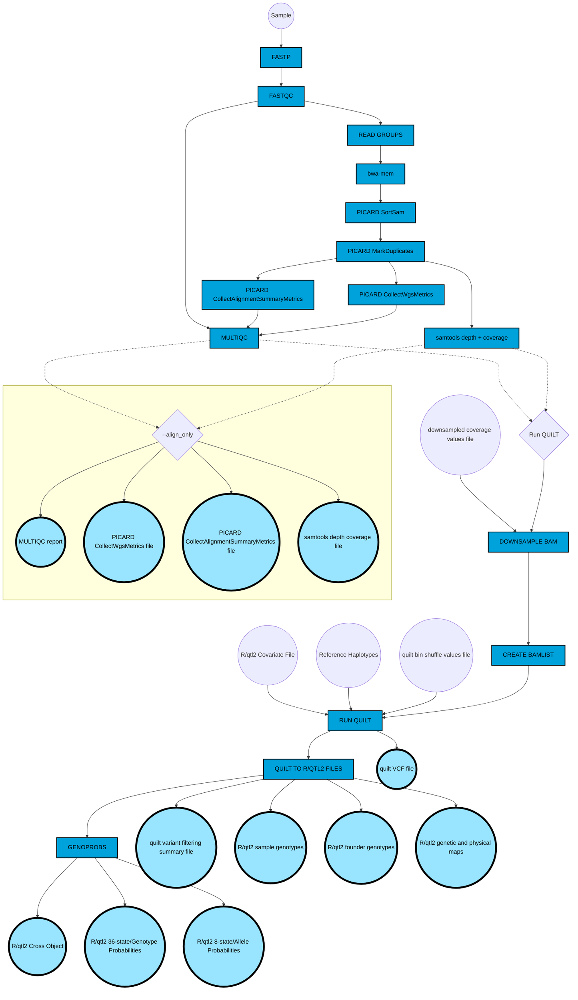

# quilt-nf: A Nextflow pipeline for haplotype reconstruction using low-coverage whole-genome sequencing data

These workflows support the service offered by JAX Genome Technologies for haplotype reconstruction with low-pass WGS. Please contact [Sam Widmayer](mailto:samuel.widmayer@jax.org)  or [Dan Gatti](mailto:dan.gatti@jax.org) for more information.

JAX users are required to have access to the Sumner cluster, and to have Nextflow installed in their home directory. Any setup for external users will require additional support, and those wishing to share these workflows are encouraged to contact the maintainers of this repository.

This pipeline is implemented using [Nextflow](https://www.nextflow.io/), a scalable, reproducible, and increasingly common language used in the development and maintenance of bioinformatics workflows. The modular nature of the workflow is enabled by software containers, such as [Docker](https://www.docker.com/) and [Singularity](https://sylabs.io/singularity), with all the software requirements for executing each step. Specific combinations and versions of software are specified in each container making analyses perfectly reproducible over time as long as the source data is unchanged.

## Overview



**Execution:**

On the JAX HPC, from within the `quilt-nf` directory:

``` bash
sbatch run_scripts/quilt_DO.sh [run name]
```
A prospective user can write their own run script using the following template:

``` bash
#!/bin/bash
#SBATCH --mail-user={USER.EMAIL}
#SBATCH --job-name=QUILT-NF
#SBATCH --mail-type=END,FAIL
#SBATCH -p compute
#SBATCH -q batch
#SBATCH -t 72:00:00
#SBATCH --mem=1G
#SBATCH --ntasks=1

cd $SLURM_SUBMIT_DIR

# LOAD NEXTFLOW
module use --append /projects/omics_share/meta/modules
module load nextflow

# RUN PIPELINE
nextflow main.nf \
--workflow quilt \
-profile sumner2 \
--sample_folder '{PATH TO DIRECTORY CONTAINTING FASTQ FILES}' \
--gen_org mouse \
--pubdir '{PATH TO DESIRED RESULTS DIRECTORY' \
--extension 'fastq.gz' \ # this is the typical file extension, but see run_scripts/quilt_DO_ddRADseq.sh for alternative example
--pattern="*_R{1,2}*" \ # see above comment
--library_type "seqwell" \ # see above comment
--run_name $1 \
-w '{PATH TO DESIRED NEXTFLOW WORK DIRECTORY}' \ # on JAX, use /flashscratch/{USER} or /flashscratch/{OTHER}
--downsample_to_cov '{PATH TO .CSV WITH COVERAGE VALUES TO DOWNSAMPLE TO}' \
--bin_shuffling_file '{PATH TO .CSV WITH QUILT BIN SHUFFLE RADIUS VALUES}' \
--cross_type 'do' \
--ref_file_dir '{PATH TO DIRECTORY WITH REFERENCE HAPLOTYPE FILES}' \
--covar_file '{PATH TO R/QTL2 COVAR FILE}' \
--comment "This script will run haplotype inference on DO lcWGS data" \
-resume
```
